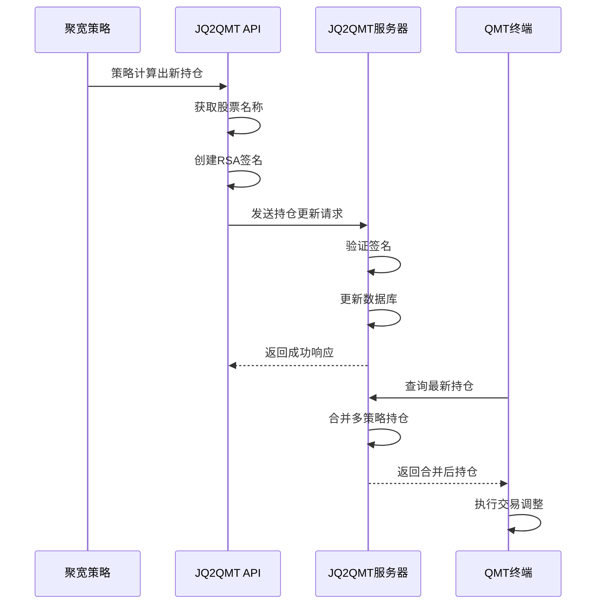
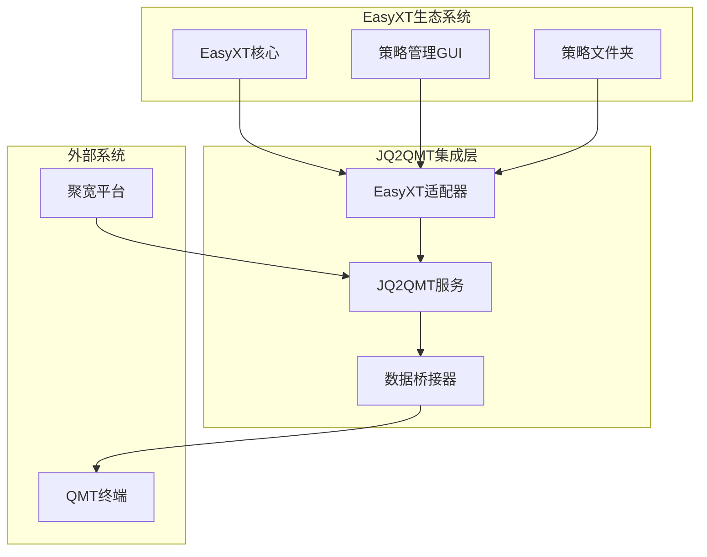

# JQ2QMT项目深度分析报告

## 📋 项目概述

**项目名称**: jq2qmt (聚宽转QMT)  
**项目地址**: https://github.com/breakhearts/jq2qmt  
**核心功能**: 将聚宽(JoinQuant)平台的量化策略无缝迁移到QMT(迅投QMT)交易终端

## 🎯 项目核心价值

### 1. **策略迁移桥梁**
- **问题解决**: 解决聚宽策略无法直接在QMT上运行的痛点
- **价值体现**: 让用户可以复用在聚宽平台上开发的成熟策略
- **技术意义**: 提供了一套完整的API转换和数据同步机制

### 2. **持仓管理中心**
- **集中管理**: 统一管理多个策略的持仓信息
- **实时同步**: 支持实时持仓数据更新和查询
- **数据持久化**: 使用SQLite数据库存储持仓历史

### 3. **安全认证体系**
- **双重认证**: 支持RSA加密认证和简单API密钥认证
- **灵活配置**: 可根据环境需求选择合适的认证方式
- **内部API**: 提供密码保护的内部管理接口

## 🏗️ 技术架构分析

### 核心组件架构

```
jq2qmt/
├── src/
│   ├── app.py                    # Flask Web服务主程序
│   ├── api/
│   │   ├── jq_qmt_api.py        # 聚宽API客户端
│   │   └── qmt_jq_trade/        # QMT交易接口
│   ├── auth/
│   │   └── simple_crypto_auth.py # 认证系统
│   ├── models/
│   │   └── models.py            # 数据模型
│   └── templates/               # Web界面模板
├── example_usage.py             # 使用示例
├── example_internal_api.py      # 内部API示例
└── API_USAGE.md                # API使用文档
```

### 1. **Web服务层 (Flask)**

#### 核心功能
- **RESTful API**: 提供标准的REST接口
- **持仓管理**: 支持持仓的增删改查操作
- **Web界面**: 提供可视化的持仓管理界面
- **认证中间件**: 统一的请求认证处理

#### 关键API端点
```python
# 持仓更新 (外部API - 需要RSA认证)
POST /api/v1/positions/update

# 持仓更新 (内部API - 密码认证)  
POST /api/v1/positions/update/internal

# 持仓查询
GET /api/v1/positions/strategy/<strategy_name>
GET /api/v1/positions/total
GET /api/v1/positions/all

# 认证信息
GET /api/v1/auth/info

# 密码管理
GET /api/v1/internal/password/info
POST /api/v1/internal/password/set
```

### 2. **认证系统 (RSA + 简单密钥)**

#### RSA加密认证流程
```python
# 1. 客户端创建认证数据
auth_data = {
    'client_id': 'client1',
    'timestamp': int(time.time())
}

# 2. 使用私钥签名
message = json.dumps(auth_data, sort_keys=True)
signature = private_key.sign(message, padding.PSS(...), hashes.SHA256())

# 3. 编码为Base64令牌
auth_token = base64.b64encode(json.dumps({
    'auth_data': auth_data,
    'signature': base64.b64encode(signature).decode()
}).encode()).decode()

# 4. 在请求头中发送
headers = {'X-Auth-Token': auth_token}
```

#### 安全特性
- **时间戳验证**: 防止重放攻击
- **RSA签名**: 确保请求来源可信
- **密钥分离**: 私钥客户端，公钥服务端
- **令牌过期**: 可配置的令牌有效期

### 3. **数据模型层 (SQLAlchemy)**

#### 策略持仓模型
```python
class StrategyPosition(db.Model):
    id = db.Column(db.Integer, primary_key=True)
    strategy_name = db.Column(db.String(100), unique=True)
    positions = db.Column(db.JSON)  # 持仓数据JSON格式
    update_time = db.Column(db.DateTime)
```

#### 持仓数据结构
```json
{
    "strategy_name": "双均线策略",
    "positions": [
        {
            "code": "000001.SZ",
            "name": "平安银行", 
            "volume": 1000,
            "cost": 12.50
        }
    ]
}
```

#### 高级功能
- **持仓合并**: 支持多策略持仓汇总
- **调整策略**: 支持负持仓的调整操作
- **数据验证**: 完整的数据格式和业务逻辑验证

### 4. **客户端API (JQQMTAPI)**

#### 核心功能
```python
class JQQMTAPI:
    def __init__(self, private_key_file=None, use_crypto_auth=True):
        # 初始化认证配置
        
    def update_positions(self, strategy_name, positions):
        # 更新策略持仓到服务器
        
    def get_stock_name(self, code):
        # 使用聚宽API获取股票名称
```

#### 聚宽集成
- **API调用**: 直接调用聚宽的`get_security_info`获取股票信息
- **数据转换**: 将聚宽格式的数据转换为QMT格式
- **错误处理**: 完善的异常处理和重试机制

## 🔄 工作流程分析

### 典型使用场景



### 数据流转过程

1. **策略执行阶段**
   - 聚宽策略运行，计算出目标持仓
   - 调用`JQQMTAPI.update_positions()`更新持仓

2. **数据传输阶段**
   - API客户端创建RSA签名
   - 通过HTTPS发送到JQ2QMT服务器
   - 服务器验证签名并存储数据

3. **持仓查询阶段**
   - QMT终端查询最新持仓
   - 服务器合并多策略持仓
   - 返回标准化的持仓数据

4. **交易执行阶段**
   - QMT根据持仓差异执行交易
   - 实现策略持仓的自动调整

## 💡 核心优势

### 1. **技术优势**
- **解耦设计**: 聚宽策略与QMT交易完全解耦
- **标准化接口**: 提供统一的持仓管理API
- **高安全性**: RSA加密确保数据传输安全
- **高可用性**: Flask + SQLite的轻量级架构

### 2. **业务优势**
- **策略复用**: 聚宽策略可直接迁移使用
- **多策略管理**: 支持同时运行多个策略
- **实时同步**: 持仓变化实时反映到QMT
- **历史追踪**: 完整的持仓变更历史记录

### 3. **运维优势**
- **部署简单**: 单机部署，配置简单
- **监控友好**: 提供Web界面和API监控
- **扩展性好**: 模块化设计，易于扩展
- **文档完善**: 详细的API文档和使用示例

## 🔧 与EasyXT项目的集成方案

### 集成架构设计



### 1. **EasyXT适配器开发**

#### 创建适配器类
```python
# strategies/adapters/jq2qmt_adapter.py
class EasyXTJQ2QMTAdapter:
    def __init__(self, jq2qmt_config):
        self.jq2qmt_api = JQQMTAPI(**jq2qmt_config)
        self.position_manager = PositionManager()
    
    def sync_positions_to_qmt(self, strategy_name, positions):
        """将EasyXT策略持仓同步到QMT"""
        # 转换持仓格式
        qmt_positions = self._convert_positions_format(positions)
        # 发送到JQ2QMT服务器
        return self.jq2qmt_api.update_positions(strategy_name, qmt_positions)
    
    def get_merged_positions(self, strategy_names=None):
        """获取合并后的持仓信息"""
        # 从JQ2QMT服务器获取持仓
        # 转换为EasyXT格式
        pass
```

### 2. **GUI界面集成**

#### 在策略管理界面添加JQ2QMT功能
```python
# gui_app/widgets/jq2qmt_widget.py
class JQ2QMTWidget(QWidget):
    def __init__(self):
        super().__init__()
        self.init_ui()
    
    def init_ui(self):
        # JQ2QMT服务器配置
        self.server_config_group = QGroupBox("JQ2QMT服务器配置")
        
        # 持仓同步控制
        self.sync_control_group = QGroupBox("持仓同步控制")
        
        # 持仓查看器
        self.position_viewer = QTableWidget()
```

### 3. **策略基类扩展**

#### 为BaseStrategy添加JQ2QMT支持
```python
# strategies/base/strategy_template.py (扩展)
class BaseStrategy:
    def __init__(self):
        # 原有初始化代码...
        self.jq2qmt_adapter = None
        if self.config.get('enable_jq2qmt'):
            self.jq2qmt_adapter = EasyXTJQ2QMTAdapter(
                self.config['jq2qmt_config']
            )
    
    def update_positions(self, positions):
        """更新持仓 - 扩展支持JQ2QMT同步"""
        # 原有持仓更新逻辑...
        
        # 同步到JQ2QMT
        if self.jq2qmt_adapter:
            try:
                self.jq2qmt_adapter.sync_positions_to_qmt(
                    self.strategy_name, positions
                )
                self.logger.info("持仓已同步到JQ2QMT服务器")
            except Exception as e:
                self.logger.error(f"JQ2QMT同步失败: {e}")
```

### 4. **配置管理集成**

#### 添加JQ2QMT配置选项
```python
# config/jq2qmt_config.py
JQ2QMT_CONFIG = {
    'enabled': False,  # 是否启用JQ2QMT集成
    'server_url': 'http://localhost:5366',
    'auth_config': {
        'use_crypto_auth': True,
        'private_key_file': 'keys/easyxt_private.pem',
        'client_id': 'easyxt_client'
    },
    'sync_settings': {
        'auto_sync': True,  # 自动同步持仓
        'sync_interval': 30,  # 同步间隔(秒)
        'retry_times': 3  # 重试次数
    }
}
```

### 5. **数据格式转换器**

#### EasyXT与JQ2QMT数据格式转换
```python
# strategies/adapters/data_converter.py
class DataConverter:
    @staticmethod
    def easyxt_to_jq2qmt(easyxt_positions):
        """EasyXT持仓格式转JQ2QMT格式"""
        jq2qmt_positions = []
        for pos in easyxt_positions:
            jq2qmt_pos = {
                'code': pos['symbol'],  # 股票代码转换
                'name': pos.get('name', ''),
                'volume': pos['quantity'],
                'cost': pos['avg_price']
            }
            jq2qmt_positions.append(jq2qmt_pos)
        return jq2qmt_positions
    
    @staticmethod
    def jq2qmt_to_easyxt(jq2qmt_positions):
        """JQ2QMT持仓格式转EasyXT格式"""
        easyxt_positions = []
        for pos in jq2qmt_positions:
            easyxt_pos = {
                'symbol': pos['code'],
                'name': pos.get('name', ''),
                'quantity': pos['volume'],
                'avg_price': pos['cost']
            }
            easyxt_positions.append(easyxt_pos)
        return easyxt_positions
```

## 🚀 集成实施计划

### 阶段一：基础集成 (1-2周)
1. **环境搭建**
   - 在strategies目录下部署JQ2QMT服务
   - 配置RSA密钥对
   - 测试基本API功能

2. **适配器开发**
   - 开发EasyXTJQ2QMTAdapter类
   - 实现数据格式转换
   - 添加错误处理和日志

3. **配置集成**
   - 将JQ2QMT配置集成到EasyXT配置系统
   - 添加启用/禁用开关

### 阶段二：GUI集成 (2-3周)
1. **界面开发**
   - 在策略管理界面添加JQ2QMT配置面板
   - 开发持仓查看器
   - 添加同步状态显示

2. **功能集成**
   - 在策略控制面板添加JQ2QMT同步选项
   - 实现一键同步功能
   - 添加持仓对比功能

### 阶段三：高级功能 (2-3周)
1. **自动化同步**
   - 实现定时自动同步
   - 添加同步失败重试机制
   - 开发同步状态监控

2. **多策略管理**
   - 支持多策略持仓合并
   - 实现策略间持仓冲突检测
   - 添加持仓分配算法

3. **监控告警**
   - 开发同步状态监控
   - 添加异常告警机制
   - 实现持仓差异报告

## 📊 预期收益

### 1. **功能增强**
- **策略迁移**: 支持聚宽策略无缝迁移
- **多平台支持**: 同时支持EasyXT和QMT
- **持仓统一管理**: 集中管理所有策略持仓

### 2. **用户体验**
- **操作简化**: 一键同步持仓到QMT
- **可视化管理**: 图形化的持仓管理界面
- **实时监控**: 实时查看同步状态

### 3. **技术价值**
- **架构扩展**: 为EasyXT增加外部系统集成能力
- **标准化**: 建立策略持仓管理标准
- **可扩展性**: 为后续集成其他交易系统奠定基础

## 🎯 总结

JQ2QMT项目为EasyXT提供了一个优秀的外部系统集成范例。通过集成这个项目，EasyXT可以：

1. **扩展交易能力**: 支持更多交易终端
2. **提升用户价值**: 让用户可以复用聚宽策略
3. **增强竞争力**: 提供更完整的量化交易解决方案
4. **建立生态**: 为后续集成更多外部系统建立基础

这个集成不仅是技术上的融合，更是EasyXT向完整量化交易生态系统发展的重要一步。